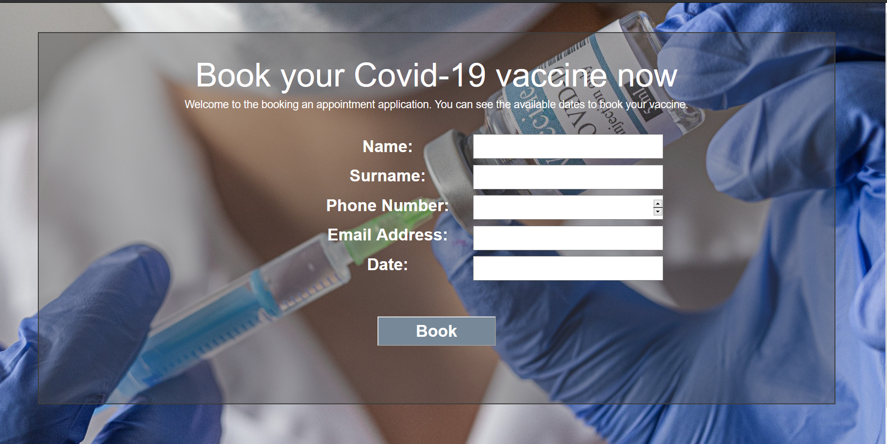
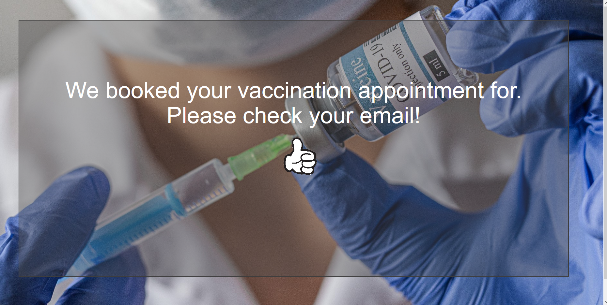

# Vaccination Booking Application

This idea for this project came up with the vaccination from the COVID-19 vaccine.

I build the project in DJANGO, and the idea and usage of the application is to book an appointment for a vaccine.

Other than that this application also gives information how important the vaccine is.

Too book an appointment the user should give 
    Name, Surname, Phone number, Email address, and Date&Time
    So in this way the Hospital can calls and confirm his appointment.

Booking:

Result:

Note: 90% done.. Still undergoing modifications
